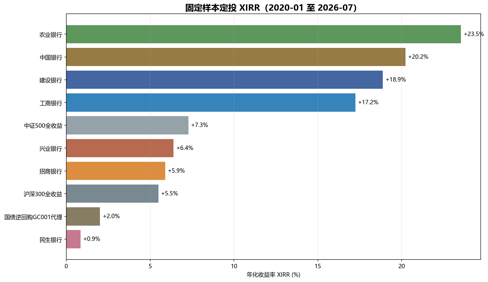
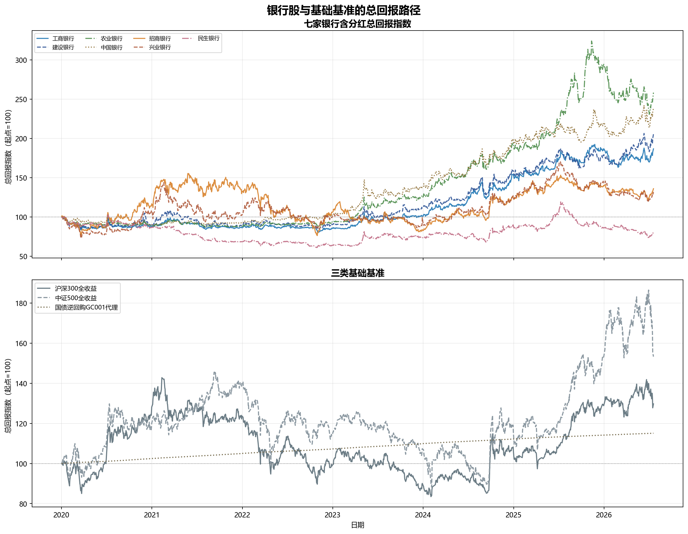
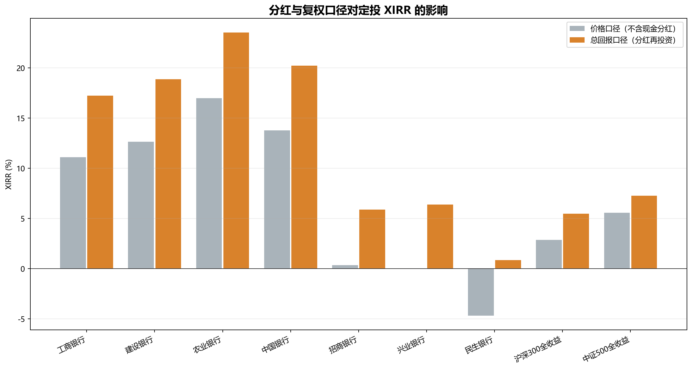
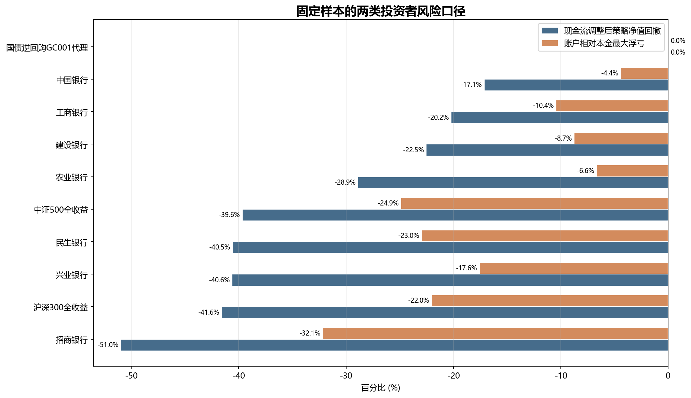
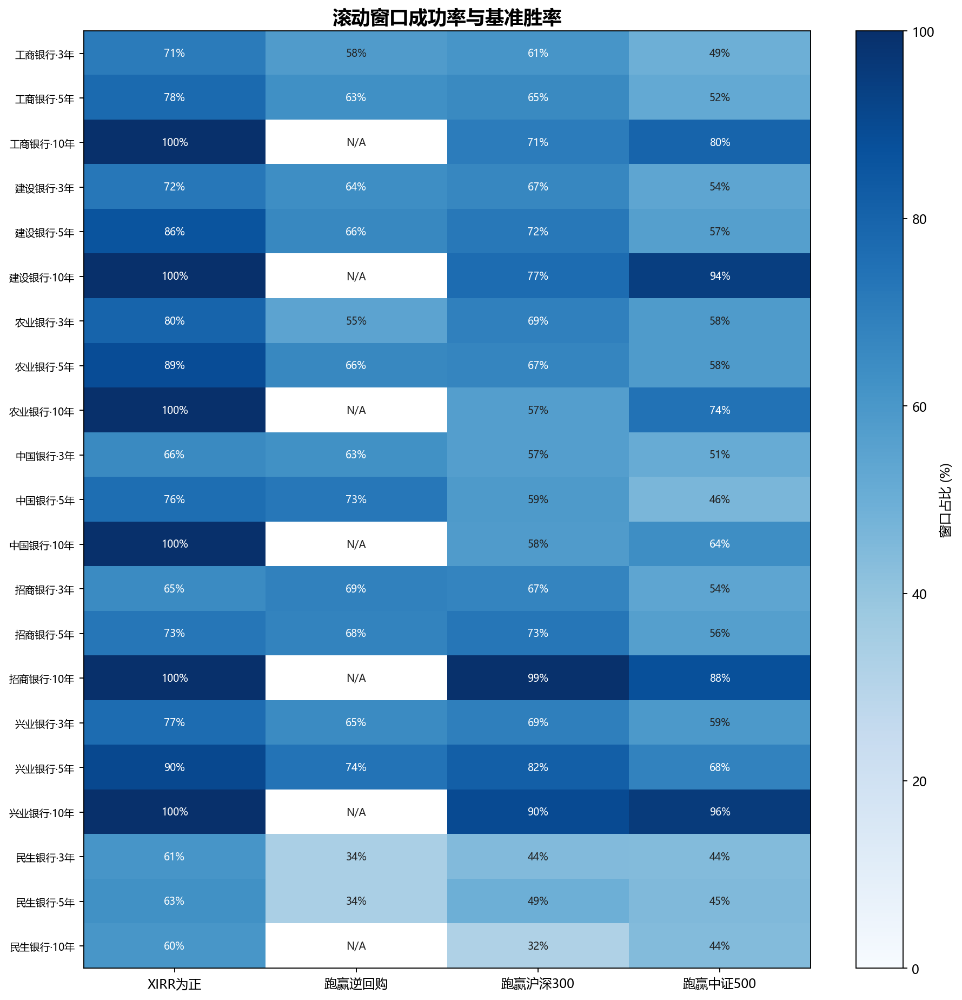

# 七家银行定投与三类基础基准回测报告

> **固定样本**：2020-01 至 2026-07，每月第一个可交易日投入 3,000 元
> **银行范围**：工商、建设、农业、中国、招商、兴业、民生
> **基础基准**：国债逆回购 GC001 代理、沪深300全收益、中证500全收益
> **数据截止**：2026-07-20

---

## 一、结论先行

固定样本内，**6/7** 家银行跑赢国债逆回购代理，其中 **6/7** 跑赢沪深300全收益、**4/7** 跑赢中证500全收益。但固定起止点不能证明长期稳定超额收益，是否“稳定跑赢”应以滚动窗口的同起点、同终点比较为准。

国债逆回购代理的固定样本 XIRR 为 **2.0%**，沪深300全收益为 **5.5%**，中证500全收益为 **7.3%**。银行结果必须在这三个基准之上分别解释：逆回购衡量低风险资金机会成本，两类全收益指数衡量承担股票市场风险后的替代收益。

---

## 二、基准与收益口径

- **国债逆回购**：采用上交所 204001 一天期回购定盘利率作为 GC001 的可复核代理，按相邻交易日之间的实际日历天数计息并连续滚动。它不是个人账户的实际成交价，未计手续费与成交偏差。
- **沪深300**：使用中证官方全收益指数 `H00300`，而不是仅反映价格变化的 `000300`。
- **中证500**：使用中证官方全收益指数 `H00905`，而不是仅反映价格变化的 `000905`。
- **银行股**：使用不复权收盘价；现金分红按除权日税前每股派息计算，并在除权日收盘立即再投资；送股和转增按每股比例增加份额。

这种处理避免把长期高分红股票的加法前复权价格误当作可交易价格。前复权序列可能接近零甚至为负，不能直接用于跨越多年、包含多笔外部现金流的定投买入。

---

## 三、固定样本结果

| 标的 | 类别 | 期数 | 最终市值（元） | XIRR | 本金最大浮亏 | 标的总回报最大回撤 | 策略净值最大回撤 |
|---|---|---:|---:|---:|---:|---:|---:|
| 国债逆回购GC001代理 | 现金基准 | 79 | 253,264 | +2.0% | +0.0% | +0.0% | +0.0% |
| 沪深300全收益 | 权益基准 | 79 | 284,161 | +5.5% | -22.0% | -41.6% | -41.6% |
| 中证500全收益 | 权益基准 | 79 | 301,462 | +7.3% | -24.9% | -39.6% | -39.6% |
| 工商银行 | 四大行 | 79 | 418,804 | +17.2% | -10.4% | -20.2% | -20.2% |
| 建设银行 | 四大行 | 79 | 441,952 | +18.9% | -8.7% | -22.5% | -22.5% |
| 农业银行 | 四大行 | 79 | 514,864 | +23.5% | -6.6% | -28.9% | -28.9% |
| 中国银行 | 四大行 | 79 | 461,952 | +20.2% | -4.4% | -17.1% | -17.1% |
| 招商银行 | 股份行 | 79 | 287,952 | +5.9% | -32.1% | -51.0% | -51.0% |
| 兴业银行 | 股份行 | 79 | 292,753 | +6.4% | -17.6% | -40.6% | -40.6% |
| 民生银行 | 股份行 | 79 | 243,747 | +0.9% | -23.0% | -40.5% | -40.5% |

三个口径分别回答不同问题：账户相对本金最大浮亏回答“最差时比累计投入亏多少”；标的总回报最大回撤回答“含分红的标的净值从高点跌了多少”；策略净值最大回撤先剔除每笔新增本金，再衡量策略单位净值从高点跌了多少。当前模型始终满仓、允许碎股且不保留现金，因此后两列数值相同；这是模型条件下的结果相等，不是把两种定义混用。

---

## 四、分红再投资与复权校核

| 标的 | 价格口径 XIRR | 总回报口径 XIRR | 分红贡献 |
|---|---:|---:|---:|
| 工商银行 | +11.1% | +17.2% | +6.1 个百分点 |
| 建设银行 | +12.6% | +18.9% | +6.2 个百分点 |
| 农业银行 | +17.0% | +23.5% | +6.6 个百分点 |
| 中国银行 | +13.8% | +20.2% | +6.5 个百分点 |
| 招商银行 | +0.3% | +5.9% | +5.6 个百分点 |
| 兴业银行 | -0.0% | +6.4% | +6.4 个百分点 |
| 民生银行 | -4.7% | +0.9% | +5.5 个百分点 |
| 沪深300全收益 | +2.9% | +5.5% | +2.6 个百分点 |
| 中证500全收益 | +5.6% | +7.3% | +1.7 个百分点 |

校核方法：银行股分别用“不复权价格、不计现金分红”和“不复权价格、显式分红再投资”重算；沪深300和中证500分别比较价格指数与官方全收益指数。同一只资产满仓、允许碎股且全部资金立即投入时，标的总回报净值与现金流调整后的策略净值应重合，测试要求最大误差不超过 `1e-10`。

---

## 五、风险比较

逆回购代理净值按非负定盘利率连续累积，因此模型回撤为 0；这不代表逆回购绝对无风险，实际仍有交易规则、成交利率、资金可用时间和操作风险。股票类基准及银行股的回撤均来自含分红总回报净值。

---

## 六、滚动窗口与基准胜率

| 银行 | 期限 | 银行窗口数 | XIRR为正 | 跑赢逆回购（可比窗） | 跑赢沪深300 | 跑赢中证500 | 最差XIRR |
|---|---:|---:|---:|---:|---:|---:|---:|
| 工商银行 | 3年 | 203 | 71% | 58% (86) | 61% | 49% | -9.3% |
| 工商银行 | 5年 | 179 | 78% | 63% (62) | 65% | 52% | -4.9% |
| 工商银行 | 10年 | 119 | 100% | N/A (2) | 71% | 80% | +3.4% |
| 建设银行 | 3年 | 192 | 72% | 64% (86) | 67% | 54% | -8.8% |
| 建设银行 | 5年 | 168 | 86% | 66% (62) | 72% | 57% | -5.9% |
| 建设银行 | 10年 | 108 | 100% | N/A (2) | 77% | 94% | +4.7% |
| 农业银行 | 3年 | 158 | 80% | 55% (86) | 69% | 58% | -3.9% |
| 农业银行 | 5年 | 134 | 89% | 66% (62) | 67% | 58% | -1.6% |
| 农业银行 | 10年 | 74 | 100% | N/A (2) | 57% | 74% | +3.6% |
| 中国银行 | 3年 | 206 | 66% | 63% (86) | 57% | 51% | -10.2% |
| 中国银行 | 5年 | 182 | 76% | 73% (62) | 59% | 46% | -9.6% |
| 中国银行 | 10年 | 122 | 100% | N/A (2) | 58% | 64% | +3.7% |
| 招商银行 | 3年 | 212 | 65% | 69% (86) | 67% | 54% | -23.0% |
| 招商银行 | 5年 | 188 | 73% | 68% (62) | 73% | 56% | -12.5% |
| 招商银行 | 10年 | 128 | 100% | N/A (2) | 99% | 88% | +6.4% |
| 兴业银行 | 3年 | 199 | 77% | 65% (86) | 69% | 59% | -12.1% |
| 兴业银行 | 5年 | 175 | 90% | 74% (62) | 82% | 68% | -5.7% |
| 兴业银行 | 10年 | 115 | 100% | N/A (2) | 90% | 96% | +3.5% |
| 民生银行 | 3年 | 212 | 61% | 34% (86) | 44% | 44% | -16.1% |
| 民生银行 | 5年 | 188 | 63% | 34% (62) | 49% | 45% | -12.5% |
| 民生银行 | 10年 | 128 | 60% | N/A (2) | 32% | 44% | -7.1% |

每个窗口连续投入 `期限 × 12` 期，并在自己的结束月估值。逆回购官方接口当前实际返回的数据始于 2016-07-26，因此较早银行窗口没有逆回购可比值；括号内为真正参与比较的窗口数。少于 12 个可比起点时胜率显示为 `N/A`。沪深300和中证500比较也只使用两边起止月份完全一致的窗口。

相邻滚动窗口高度重叠，胜率不能当作独立重复试验的概率。它更适合回答“结论对起点是否敏感”，不适合直接预测下一窗口胜率。

---

## 七、限制与下一步

1. 允许碎股，未计股票佣金、最低佣金、印花税、分红税及买卖价差。
2. 分红按除权日收盘立即再投资，真实到账日和成交价可能不同。
3. 204001 使用定盘利率代理个人实际成交收益，并按相邻交易日的日历天数计息；应进一步加入手续费和结算规则压力测试。
4. 七家银行是事后选择的存续公司，仍有幸存者偏差和选股偏差。
5. 本报告只研究历史市场收益，没有纳入净息差、不良贷款率、拨备覆盖率、资本充足率和估值变化等基本面解释变量。

因此，可以比较的是“这些历史窗口中银行股相对三个基础基准的结果”；不能据此承诺未来收益或把高股息等同于低风险。

---

## 八、数据与复现

- 数据获取：`report/data_fetch.py`
- 回测引擎：`report/analysis.py`
- 报告生成：`report/build_report.py`
- 口径校验：`report/verify_returns.py`
- 自动测试：`report/test_analysis.py`
- 数据快照：`report/data/`

来源：

- [中证指数历史行情接口](https://www.csindex.com.cn/csindex-home/perf/index-perf)
- [沪深300指数编制方案](https://oss-ch.csindex.com.cn/static/html/csindex/public/uploads/indices/detail/files/zh_CN/000300_Index_Methodology_cn.pdf)
- [中证500指数资料](https://oss-ch.csindex.com.cn/static/html/csindex/public/uploads/indices/detail/files/zh_CN/000905factsheet.pdf)
- [上交所204001回购定盘利率](https://bond.sse.com.cn/data/standard/repocurve/onerepo/)
- 腾讯证券不复权日线接口
- 新浪财经分红配股详情
