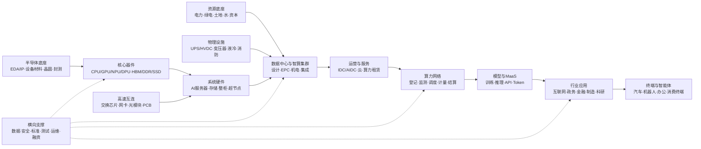

# 中国算力产业链与招投标研究

> **数据截止日：** 2026-08-09  
> **研究范围：** 中国大陆算力基础设施及其上游硬件、中游建设运营、下游模型与行业应用；招投标样本覆盖 2025-01-01 至 2026-08-09 公开信息  
> **金额口径：** 人民币；预算、最高限价、框架金额、中标额和合同额分别保留原公告定义，含税与不含税不强行换算  
> **证据优先级：** 政府及监管部门、采购人/业主平台、公共资源交易平台、公司公告等一手来源优先  
> **核心结论：** 中国算力产业的主矛盾，已由“有没有机房”转为“高密度智算能否获得芯片、内存、网络、电力与冷却支持，并被真实客户高效调用和持续付费”。

本文是产业与采购研究，不构成证券买卖、项目投标或商业决策建议。文中公司只用于说明产业位置，不代表完整名单或投资推荐。

## 0. AI 研究偏见自觉

本报告存在四类天然偏差，读者应先于结论阅读：

1. **公开性偏差。** 政府采购、国央企和公共资源项目更容易检索，互联网大厂自建、民营企业直接采购和集团内部订单可能被低估。
2. **大项目偏差。** EPC、框架采购金额高、曝光多，但不等于利润率高；小额软件、运维和推理服务项目可能更接近经常性收入，却更分散。
3. **供给侧偏差。** 政策文件和项目公告大量描述“建了多少”，较少披露 GPU 有效利用率、单位 Token 成本、续约率和项目现金回收。
4. **幸存者与阶段偏差。** 已公告中标不等于按期交付和确认收入，框架入围不等于实际下单；未检索到结果也不代表项目终止。

因此，本文把招投标样本当作**需求结构与采购方式的观察窗**，不将其外推为市场规模或企业份额。

## 1. 结论摘要

### 1.1 六个最重要的结论

1. **智算已成为增量中心，但官方统计口径发生过切换。** 截至 2026 年 6 月底，工信部披露全国智能算力达到 **2185 EFLOPS（FP16）**、同比增长 177%，全国算力设施整体上架率为 **71.4%**；这组 FP16 智算数据不能与 2023—2024 年未标精度或 FP32 的“总算力”直接计算增长率。[工信部 2026 年上半年发布会](https://www.miit.gov.cn/xwfb/bldhd/art/2026/art_bc4cf76777cb4fd2896082ca2ff7039d.html)

2. **产业已从单体数据中心建设进入“芯片—集群—网络—电力—应用”系统竞争。** 模型训练推动万卡集群和高密度机柜，瓶颈由普通机房面积转向 AI 加速芯片、HBM/高速内存、先进封装、卡间与机间互连、高速光模块、高阶 PCB、供配电和液冷；推理增长又把竞争延伸到调度、推理优化、API、Token 计费和行业工作流。

3. **价值未必停留在收入最大的一环。** AI 芯片和软件生态拥有最高技术壁垒，也承担最高研发、制裁和迭代风险；光互连、网络、PCB、供电和液冷受益于集群密度提升；服务器和项目集成收入规模大，但部件转售、竞标降价、验收和应收账款可能压缩经济租金。

4. **“东数西算”不是把所有计算搬到西部。** 训练、离线分析、渲染和备份更适合向绿电丰富地区迁移；金融、工业控制、远程医疗、交互式推理等低时延业务仍需靠近东部需求与数据。最有质量的算力资产需同时具备**可获得的电力、可靠网络和已签约客户**。[国家发改委“东数西算”答记者问](https://www.ndrc.gov.cn/xxgk/jd/jd/202202/t20220217_1315795_ext.html)

5. **监测覆盖扩大，但“接入”离“商品化调度”仍有距离。** 2025 年底，全国一体化算力网平台监测 1129 个设施、总算力 102 万 PFLOPS，其中智算 83.4 万 PFLOPS，可调度算力 11 万 PFLOPS。11/102 约为 10.8%，但这只是两个披露口径的算术比，**不是利用率或消纳率**；差距更适合用于提示异构适配、网络、计量、结算与责任边界仍需打通。[《数字中国发展报告（2025年）》](https://www.nda.gov.cn/sjj/ywpd/sjzg/0608/ff808081-9e81e847-019e-a7020a06-00a9.pdf)

6. **多渠道招投标已经覆盖四种商业形态。** 报告列示 22 个一手页面可核验样本，另把 3 个运营商动态页面项目降级为待复核线索；采购形态包括直接购买 AI 服务器/存储，按年或卡时租赁算力，运营商或央企框架采购，以及智算中心/变电站/机电系统 EPC。公开金额从几十万元的单项设备延伸至数亿元的 EPC，但预算、框架金额、中标额、合同额与税口径不同，不能求和外推市场规模。

### 1.2 一句话产业判断

```text
过去：土地 + 机房 + 通用服务器
现在：AI芯片 + 高速互连 + 高密供电/液冷 + 集群工程
下一步：异构调度 + 推理经济性 + Token/API + 行业工作流
```

## 2. 口径先行：五组不能混用的指标

算力行业最容易产生“数字看起来精确、比较却不成立”的错误。本文遵守下列边界。

| 指标 | 含义 | 常见误用 | 本文处理 |
| --- | --- | --- | --- |
| FLOPS、PFLOPS、EFLOPS | 浮点运算能力；1 EFLOPS = 1000 PFLOPS | 把 FP64、FP32、FP16、BF16、INT8 或“等效算力”直接相加、同比 | 只有精度和统计范围一致时才比较；未标精度单列 |
| 总算力与智能算力 | 总算力通常含通算、超算、智算；智能算力多指 AI 加速能力 | 用 FP16 智算值证明早期“总算力”规划超额完成 | 不作这种比较 |
| 已建、监测接入、可调度、实际使用 | 分别代表物理供给、平台看得见、平台可调用、任务真实运行 | 把监测覆盖或可调度规模当作利用率 | 分列，并明确不能替代 |
| 机架、上架率、功率使用率、GPU 利用率/MFU | 从空间安装到功率、芯片工作和模型有效计算的不同层级 | 用全国上架率推断 GPU 满载或项目回报 | 只把上架率视为设施层面的运营指标 |
| 预算、最高限价、框架额、中标额、合同额 | 分别对应采购约束、入围上限与最终合同等不同阶段 | 把框架金额全部视作收入，或把未含税与含税混加 | 保留原定义；汇总只作样本描述 |

PUE（数据中心总能耗/IT 设备能耗）也只反映设施能效的一部分。较低 PUE 不自动意味着高绿电比例、低水耗、高芯片利用率或项目盈利。

## 3. 产业发展的因果链

### 3.1 从需求到资本开支

```text
基础模型训练、智能体和行业AI需求
  → 训练参数、数据量、并发推理和Token调用增加
    → AI芯片、内存容量/带宽和集群规模上升
      → 卡间/机间互连、存储、PCB、供电与散热压力上升
        → 高密智算中心、绿电和算力通道建设
          → 云实例、GPU小时、Token/API及行业解决方案供给
            → 真实利用率与付费反过来约束下一轮资本开支
```

这条链条存在两个重要“反作用”：一是模型压缩、推理优化和芯片能效提升可能降低单位任务所需算力；二是单价下降又可能刺激更多调用。因而 Token 数量增长不能机械等同于服务器收入增长。

### 3.2 从政策到资源配置

```text
地方分散建设
  → 全国统筹和枢纽布局
    → 8个枢纽、10个集群“东数西算”
      → 大型设施向枢纽集聚
        → 1/5/20ms算力网与高速通道
          → 异构算力监测、调度、度量、交易和结算
            → 算电协同、绿电直连、按卡时/核时/Token付费
```

## 4. 中国算力产业链全景图

### 4.1 可视化产业链



若阅读器不渲染 Mermaid，可按下列文本图理解：

```text
能源/土地/资本 ───────────────────────────────┐
EDA/IP → 设备材料 → 晶圆制造 → 先进封测       │
                              ↓               │
      AI芯片/CPU/DPU + HBM/DDR/SSD            │
                              ↓               ↓
光模块/交换机/PCB → AI服务器/存储 → 智算中心建设与集群集成
供配电/液冷/消防 ─────────────────────────────┘
                              ↓
             IDC/AIDC → 云/算力租赁 → 算力调度与交易
                              ↓
           基础模型/MaaS → 行业应用 → 智能体与终端

横向贯穿：数据、安全、标准、评测、运维、融资和合规
资金流向大体与上述产品/服务流相反。
```

### 4.2 各环节的客户、模式、壁垒和代表参与者

下表的公司仅作位置示例；同一集团可能横跨芯片、集成、云和应用，计算产业规模时必须剔除内部交易与重复计算。

| 环节 | 直接付费方与收入模式 | 决定性壁垒/风险 | 代表参与者（非穷尽） |
| --- | --- | --- | --- |
| EDA、设备材料、晶圆与封测 | 芯片设计商、晶圆厂；授权、设备销售/维保、代工和封测 | 工艺、良率、IP、先进设备精度、资本强度和半导体周期 | 中芯国际、华虹、北方华创、中微公司、华大九天、芯原、长电科技、通富微电 |
| CPU、GPU、NPU、DCU、DPU | 云厂、服务器厂、运营商、互联网与政企客户；芯片、板卡、整机和软件支持 | 先进制程、HBM、封装、片间互连、编译器/算子和集群稳定性；出口限制与高研发投入 | 华为昇腾/鲲鹏、海光、寒武纪、飞腾、龙芯、摩尔线程、沐曦、壁仞、天数智芯、燧原、昆仑芯 |
| 内存与存储 | 服务器、存储和云厂商；颗粒、模组、SSD、接口芯片 | HBM 堆叠、带宽、容量、固件、耐久性、客户认证；价格与库存周期 | 长鑫存储、长江存储、澜起科技、佰维存储、江波龙、兆易创新 |
| PCB、覆铜板与封装基板 | 板卡、服务器、交换机和光模块厂；按板/面积/产品收费 | 高层数、HDI、低损耗材料、信号完整性、良率和客户认证 | 胜宏科技、沪电股份、深南电路、生益科技、鹏鼎控股 |
| 光通信与交换网络 | 云、运营商、IDC 和集成商；模块、交换机、网络 OS 和维保 | 激光器、DSP、硅光、交换 ASIC、无损网络和集群调优；速率代际切换快 | 中际旭创、新易盛、光迅科技、源杰科技；华为、新华三、锐捷、中兴、盛科通信 |
| AI 服务器、存储整机与超节点 | 云、运营商、互联网、政府和行业客户；硬件、整柜、维保和集成 | 供应链、兼容适配、高密设计、规模交付；昂贵核心部件转售使收入含金量分化 | 浪潮信息、联想、曙光、新华三、超聚变、华为、中兴 |
| 供配电、液冷与机房设备 | 数据中心业主、云和集成商；UPS/HVDC、变压器、母线、CDU、冷板/浸没、冷机、消防和运维 | 高可靠冗余、控制算法、材料兼容、漏液安全、能效与认证；存量维保相对平滑 | 科华数据、科士达、中恒电气、英维克、佳力图、申菱环境、曙光数创、华为数字能源 |
| 设计、EPC 与异构集群集成 | 地方平台、运营商、云、政府和企业；设计费、交钥匙工程、调优和运维 | 电力接入、施工管理、多芯适配、无损网络、故障恢复、验收与应收账款 | 中国建筑、中国能建、中国电建、运营商设计院；华为、浪潮、新华三、曙光、超聚变、神州数码 |
| IDC/AIDC/智算中心 | 云、互联网、金融和政企；按机柜、面积、kW/MW、托管、电费收费 | 电力、网络、SLA、融资成本、上架与功率使用、锚定客户和续约 | 三大运营商、万国数据、世纪互联、光环新网、数据港、润泽科技、宝信软件 |
| 云与 AI 算力服务 | 企业、开发者、政府和互联网；GPU 小时、实例、存储、带宽、Token/API、订阅和私有化 | 规模利用率、资本成本、模型/工具生态、渠道、安全和迁移成本；价格竞争激烈 | 阿里云、华为云、腾讯云、百度智能云、火山引擎、天翼云、移动云、联通云、京东云 |
| 算力网络与调度 | 算力中心、政府平台和终端企业；平台许可、调度佣金、带宽、托管和撮合 | 统一标识、跨域网络、计量结算、异构兼容、数据合规和平台网络效应；仍处早期 | 三大运营商、华为、曙光、优刻得、青云、PPIO 等 |
| 模型、MaaS 与推理 | 模型公司和云先承担训练费，企业/消费者按 Token、API、席位、会员或部署付费 | 人才、数据、算法、推理成本、分发入口、生态与合规；迭代和价格战强 | 千问、文心、混元、豆包、盘古、DeepSeek、智谱、MiniMax、阶跃星辰、月之暗面 |
| 行业应用与终端 | 财政、科研和企业 IT/R&D 预算，广告主、商家与消费者；项目、订阅、佣金或增值服务 | 私有数据、行业知识、用户入口、工作流改造、ROI 与长验收周期 | 互联网平台、政务/金融 IT 厂商、工业软件商、车企、机器人和智能终端厂商 |
| 数据、安全、测试和运维 | 模型、云、政府和行业客户；数据集、标注、检测、安全订阅、认证和运维 | 数据产权与质量、场景知识、安全资质、算力计量和信任 | 海天瑞声、奇安信、深信服、启明星辰；中国信通院、电子标准院、ODCC 等 |

## 5. 产业发展：从机架扩张到算力商品化

### 5.1 政策与产业阶段

| 时间 | 阶段 | 关键变化 | 一手来源 |
| --- | --- | --- | --- |
| 2020-12 | 全国统筹起点 | 四部门提出全国一体化大数据中心协同创新体系，地方分散建设开始转向全国布局、调度和绿色约束 | [国家发改委指导意见](https://www.ndrc.gov.cn/xxgk/zcfb/tz/202012/t20201228_1260496_ext.html) |
| 2021-05 | 枢纽骨架成型 | 京津冀、长三角、粤港澳、成渝及贵州、内蒙古、甘肃、宁夏成为国家算力枢纽布局 | [国家算力枢纽实施方案](https://www.ndrc.gov.cn/xxgk/zcfb/tz/202105/t20210526_1280838_ext.html) |
| 2022-02 | “东数西算”全面启动 | 8 个国家枢纽、10 个国家数据中心集群总体布局完成，明确按时延与任务特征分层 | [国家发改委答记者问](https://www.ndrc.gov.cn/xxgk/jd/jd/202202/t20220217_1315795_ext.html) |
| 2023-10 | 量化建设 | 2025 年政策目标包括总算力超过 300 EFLOPS、智算占比 35%、存储超过 1800 EB；这些是规划目标，不是当时实绩 | [算力基础设施高质量发展行动计划](https://www.gov.cn/zhengce/zhengceku/202310/P020231009520949915888.pdf) |
| 2023-12 | 全国一体化算力网 | 从机房建设扩展到异构并网、跨区调度、计量结算和算电协同，提出 1ms 城市、5ms 区域、20ms 跨枢纽时延圈 | [国家发改委等实施意见](https://www.ndrc.gov.cn/xxgk/zcfb/tz/202312/t20231229_1363000_ext.html) |
| 2024-07 | 绿色与运营约束 | 2025 年政策目标包括全国数据中心整体上架率不低于 60%、平均 PUE 低于 1.5，并强化可再生能源和单位算力能效 | [绿色低碳专项行动计划](https://www.gov.cn/zhengce/zhengceku/202407/P020240724272072479001.pdf) |
| 2025-05 | 互联互通和市场化 | 目标是 2026 年形成较完整算力标识、标准和规则体系，2028 年基本实现全国公共算力标准化互联 | [工信部算力互联互通行动计划](https://www.miit.gov.cn/cms_files/filemanager/1226211233/attach/20255/897c5bbdf9384c4bac38a74b5a7cfa4b.pdf) |
| 2025-08 至 2026 | AI 与普惠用算牵引 | 政策重心进一步转向“人工智能+”、中小企业按卡时/核时/Token 用算、城域毫秒用算和零碳算力 | [国务院“人工智能+”意见](https://www.cac.gov.cn/2025-08/27/c_1758018277755538.htm)、[工信部 2026—2028 年实施意见](https://hubca.miit.gov.cn/zwgk/zcwj/wjfb/art/2026/art_1a6880738cfc4235afeda815d6ae8ab4.html) |

### 5.2 八大枢纽与十个集群

| 国家枢纽 | 国家数据中心集群 | 任务与资源侧理解 |
| --- | --- | --- |
| 京津冀 | 张家口 | 服务首都圈需求，兼顾张家口可再生能源与跨区网络 |
| 长三角 | 长三角生态绿色一体化发展示范区、芜湖 | 靠近互联网、金融、制造和研发客户，时延与电力需共同优化 |
| 粤港澳大湾区 | 韶关 | 承接大湾区非实时及部分训练任务，同时依赖南向高质量通道 |
| 成渝 | 天府、重庆 | 西部人口与产业中心，本地需求和枢纽能力兼具 |
| 内蒙古 | 和林格尔 | 绿电与气候条件较优，适合大规模训练、离线和存储任务 |
| 贵州 | 贵安 | 既有数据中心集聚基础，面向备份、离线和云服务 |
| 甘肃 | 庆阳 | 依赖新能源、电网和东向算力通道形成规模化承接能力 |
| 宁夏 | 中卫 | 气候、能源和运营商网络基础较突出，承接训练与离线任务 |

十个集群名单可由[国家数据局 2026 年 3 月公开信息](https://www.nda.gov.cn/sjj/jgsz/jld/llh/llhldhd/0323/20260323202204680553721_pc.html)核验。2025 年，八大枢纽地区新增算力及智能算力均占全国 80% 以上，说明供给显著向枢纽集中；但实时推理和数据敏感业务仍不会简单全部西迁。

### 5.3 关键数据仪表盘

| 数据时点 | 公开数据 | 正确解读 | 来源 |
| --- | --- | --- | --- |
| 2022 年初 | 约 500 万标准机架、130 EFLOPS | “东数西算”启动基线；原发布未提供可与后来 FP16 序列直接衔接的完整口径 | [国家发改委](https://www.ndrc.gov.cn/xxgk/jd/jd/202202/t20220217_1315795_ext.html) |
| 2023 年底 | 超过 810 万标准机架；总算力 230 EFLOPS，智能算力 70 EFLOPS | 发布未明确精度，不能与 2025—2026 年 FP16 智算直接同比 | [工信部 2024 年一季度发布会](https://www.miit.gov.cn/xwdt/gxdt/ldhd/art/2024/art_7c3695b480144be9821514c10133c7b5.html) |
| 2024 年 9 月 | 超过 880 万标准机架；总算力 268 EFLOPS（FP32） | 这是 FP32 总算力序列 | [工信部“点、链、网、面”发布](https://www.miit.gov.cn/xwfb/xwfbh/qtxwfbh/art/2025/art_a117e00686bc41c5be387e82ff13d0f3.html) |
| 2024 年底 | 总算力 280 EFLOPS，智能算力 90 EFLOPS、占 32% | 国家数据局调查口径；仍不应与后续 FP16 值拼接增长曲线 | [全国数据资源调查报告（2024年）](https://www.nda.gov.cn/sjj/ywpd/sjzy/0429/ff808081-960ee580-0196-813a908a-03fb.pdf) |
| 2025 年底 | 超过 1373 万标准机架；42 个万卡智算集群；智能算力 159 万 PFLOPS，即 1590 EFLOPS（FP16） | 进入明确的 FP16 智算披露；超大型设施平均 PUE 1.34 | [数字中国发展报告（2025年）](https://www.nda.gov.cn/sjj/ywpd/sjzg/0608/ff808081-9e81e847-019e-a7020a06-00a9.pdf) |
| 2025 年底 | 平台监测 1129 个设施、102 万 PFLOPS，总智算 83.4 万 PFLOPS，可调度 11 万 PFLOPS | 监测接入、智算子集与可调度规模，不代表实际使用 | [同上](https://www.nda.gov.cn/sjj/ywpd/sjzg/0608/ff808081-9e81e847-019e-a7020a06-00a9.pdf) |
| 2026 年 6 月底 | 智能算力 2185 EFLOPS（FP16），同比增 177%；整体上架率 71.4% | 截止日最新官方值；上架率不等于 GPU 利用率 | [工信部 2026 年上半年发布会](https://www.miit.gov.cn/xwfb/bldhd/art/2026/art_bc4cf76777cb4fd2896082ca2ff7039d.html) |
| 2026 年 6 月底 | 智算地域占比：东部 55.9%、中部 10.6%、西部 32.6%、东北 0.9% | 东部低时延需求仍占主导，西部形成重要供给中心 | [同上](https://www.miit.gov.cn/xwfb/bldhd/art/2026/art_bc4cf76777cb4fd2896082ca2ff7039d.html) |
| 2026 年 6—7 月 | 近两年超过 70 条“算力大通道”；另有 145 条枢纽干线光缆、跨枢纽时延低于 20ms 的披露 | “大通道”和“干线光缆”定义不同，不相加 | [工信部](https://www.miit.gov.cn/xwfb/bldhd/art/2026/art_bc4cf76777cb4fd2896082ca2ff7039d.html)、[国家发改委网站](https://www.ndrc.gov.cn/wsdwhfz/202607/t20260727_1406699.html) |

需求侧另有一个值得观察但容易误读的代理指标：日均 Token 调用量由 2024 年初约 1000 亿增至 2025 年末约 100 万亿，2026 年 3 月底进一步超过 140 万亿。[国家数据局转载数据](https://www.nda.gov.cn/sjj/swdt/mtsy/0404/20260404154023260604626_pc.html) 这说明模型调用活动快速增长，但 Token 口径、模型效率和价格都在变化，不能直接换算为收入、GPU 数量或利润。

### 5.4 政策目标兑现不能简单打勾

| 政策目标 | 截至 2026-08-09 的判断 |
| --- | --- |
| 2025 年总算力超过 300 EFLOPS、智算占比 35% | 2025 年公开主序列已改为 FP16 智算，未同步给出同口径总算力和占比，无法严谨判断原口径是否完成 |
| 枢纽新增算力占全国新增算力 60% 以上 | 2025 年公开值为 80% 以上，按披露口径已超过目标 |
| 1ms 城市、5ms 区域、20ms 跨枢纽 | 20ms 跨枢纽已有“基本实现/低于 20ms”的官方表述；全国 1ms/5ms 覆盖率尚无统一验收数据 |
| 2025 年整体上架率不低于 60%、平均 PUE 低于 1.5 | 2026 年 6 月整体上架率 71.4%；2025 年超大型设施平均 PUE 1.34。时点和统计范围不同，只能说名义指标改善，不能当作严格同口径验收 |
| 2026 年形成较完整的互联标准、标识和规则体系 | 截止日仍在形成《算力标准体系建设指南（2026版）》并扩大自动监测，应标注“进行中” |
| 2028 年公共算力标准化互联 | 未来目标，不能写成已实现事实 |

## 6. 价值流与利润池：收入、壁垒和现金流不是一回事

### 6.1 各环节的经济性

| 环节 | 价值捕获判断 | 最应跟踪的变量 | 容易踩的坑 |
| --- | --- | --- | --- |
| AI 芯片、HBM、先进封装和软件生态 | 稀缺性与生态锁定最强，可能获得较高经济租金 | 性能/功耗、良率、供货、软件迁移成本、开发者与客户验证 | 技术路线快速变化、出口限制、高研发投入、单一大客户 |
| 高速光互连、交换网络、PCB、存储接口 | 集群规模越大，有效算力越依赖通信与内存，价值密度提升 | 400G/800G/1.6T 迭代、端口与模块量、良率、客户结构 | 云资本开支周期、扩产、代际切换和价格下行 |
| 供配电与液冷 | 机柜功率密度提高带来结构性需求，认证和可靠性形成壁垒 | 单柜 kW、液冷渗透、CDU/冷板配套、PUE/WUE、维保收入 | 项目节奏、标准不统一、漏液/腐蚀、原有机房改造难度 |
| 服务器整机和集成 | 销售额大、交付能力重要，但昂贵芯片常是成本转售 | 整柜与超节点占比、集群效率、验收、毛利、应收款 | 只看收入增速，忽略部件价格、低价中标与账期 |
| IDC/AIDC | 合同型收入可见度较好，但高固定成本放大利用率差异 | 已签约率、上架率、功率使用率、续约、电价、PUE、融资成本 | 把规划 MW/P 或机房面积当护城河；客户集中与空置期 |
| 云与算力租赁 | 可形成按量经常性收入，规模利用率和生态决定成本 | GPU/卡时价格、Token 单价、利用率、资本回收、外部商业收入 | 价格战、内部收入重复计算、服务包配置不可比 |
| 调度、计量与交易 | 若实现跨芯、跨云、跨地域调用，可能形成平台网络效应 | 接入资源、可调度资源、成交量、结算和 SLA | 仍处标准形成期，平台多而真实交易少 |
| 模型与行业应用 | 长期潜在利润池最大，因为更接近用户、数据和工作流 | 付费用户、续费、单位推理毛利、业务提效与替代成本 | 模型同质化、获客成本、私有化长验收、展示项目无 ROI |
| 电力与绿电 | 量大且成为项目许可和运营的硬约束，回报通常更稳定 | 接入容量、长期电价、绿电比例、源网荷储、可靠性 | 有电不等于有客户；PUE 低不代表碳排和水耗低 |

中国信通院研究指出，高密度机柜使传统风冷承压，冷板式液冷因兼容性和产业成熟度成为当前主要路径；具体功率阈值会随芯片和机柜设计变化，不应视为固定物理边界。[《绿色算力发展研究报告（2025）》](https://www.caict.ac.cn/english/research/whitepapers/202509/P020250903609386521052.pdf)

### 6.2 价值流正在发生的三次迁移

1. **从普通机架到有效算力。** 规划容量、服务器峰值和机架数量的解释力下降，集群通信效率、故障恢复、功率使用和模型有效计算更重要。
2. **从卖设备到卖服务。** 招标中同时出现一次性硬件、服务器年租、卡时和整包算力服务，收入确认与资本责任逐渐分离。
3. **从拥有资源到能够调度。** 互联互通政策集中解决标识、度量、接口、定价、结算和安全，说明异构算力尚未成为完全标准化商品。

## 7. 招投标调研方法

### 7.1 覆盖渠道

本次检索至少覆盖以下原始入口，既有综合政府平台，也有采购人/业主自有平台：

| 渠道类别 | 原始入口 | 适合发现的项目 |
| --- | --- | --- |
| 政府采购 | [中国政府采购网](https://www.ccgp.gov.cn/cggg/)、[政府采购意向公开](https://cgyx.ccgp.gov.cn/cgyx/pub/proJ) | 高校、科研院所、医院、中央单位的服务器、存储、算力服务和平台软件 |
| 公共资源交易 | [全国公共资源交易平台](https://www.ggzy.gov.cn/)及省市平台 | 数据中心土建、EPC、变电站、机电配套和地方平台项目 |
| 招标公共服务 | [中国招标投标公共服务平台](https://www.cebpubservice.com/) | 企业和业主依法发布的工程、设备和服务招标 |
| 运营商 | [中国移动](https://b2b.10086.cn/b2b/main/preIndex.html)、[中国电信](https://caigou.chinatelecom.com.cn/MSS-PORTAL/)、[中国联通](https://www.chinaunicombidding.cn/) | 集中采购、IDC/机房、服务器、网络、设计与运维框架 |
| 央国企/业主 | [南方电网](https://www.bidding.csg.cn/)、[中国铁塔](https://ebid.chinatowercom.cn/)、[中国邮政](https://cg.11185.cn/)、[东风电子采购](https://etp.dfmc.com.cn/) | 行业智算、AI 服务器、边缘算力、租赁、算力平台和完整基础设施 |
| 专业代理 | [中技国际](https://www.china-tender.com.cn/)、[中招联合](https://www.365trade.com.cn/) | 部分匿名或受限单位的算力租赁、设备及服务采购 |

中国移动、中国电信及部分联通页面使用 JavaScript、登录或验证码，搜索引擎镜像只能用于发现线索。正式研究应回到项目编号和采购人原始页面复核。

### 7.2 样本筛选和去重

- 时间窗：2025-01-01 至 2026-08-09；保留少量仍在投标或结果待发布的最新项目。
- 关键词：`智算中心`、`AI服务器`、`GPU服务器`、`训练服务器`、`推理服务器`、`异构算力`、`算力租赁`、`卡时`、`高性能计算`、`400G`、`液冷`、`UPS`、`变电站`、`机电配套`、`算力调度`、`算力超市`。
- 唯一键：项目/招标编号 + 标包号；采购意向、招标、变更、候选人、结果和合同被视为同一生命周期，而不是多笔需求。
- 阶段优先级：合同 > 中标结果 > 候选人 > 招标公告 > 采购意向；同时保留前一阶段用于解释金额变化。
- 金额分列：总投资、合同估算、预算/最高限价、框架金额、中标价、合同额、税口径分别存储。
- 交叉发布去重：同一公告在政府采购网、公共服务平台和采购人官网重复发布，只记一条，优先链接原始采购人或政府平台。

## 8. 代表性招投标样本

### 8.1 一手原始页面可核验样本

以下 22 条为目的抽样，不是全量数据库。状态均截至 2026-08-09；“未找到结果”只表示本轮未在可公开页面定位到结果。

| 渠道 | 采购人 / 项目 | 公告或结果时间、状态 | 采购内容 | 披露金额及口径 | 原始来源 |
| --- | --- | --- | --- | --- | --- |
| 中国政府采购网 | 中科院计算机网络信息中心：中国科技云 GPU 服务器 | 2025-05-07 中标 | 6 台 H3C GPU 服务器 | 中标 798 万元 | [中标公告](https://www.ccgp.gov.cn/cggg/zygg/zbgg/202505/t20250507_24550380.htm) |
| 中国政府采购网 | 中华全国总工会：算力租赁 | 2025-10-22 中标 | 48 PFLOPS 算力及网络、存储、安全和支持，服务 12 个月 | 中标 686 万元；整包服务，不能换算为纯算力牌价 | [中标公告](https://www.ccgp.gov.cn/cggg/zygg/zbgg/202510/t20251022_25550107.htm) |
| 中国政府采购网 | 教育部学位与研究生教育发展中心：GPU 算力服务 | 2026-06-15 中标 | 20 台、每台 8 卡的 GPU 裸金属服务器，服务一年 | 预算 550 万元，中标 522.9 万元 | [中标公告](https://www.ccgp.gov.cn/cggg/zygg/zbgg/202606/t20260615_26747480.htm) |
| 中国政府采购网 | 中国信通院：推理服务器 | 2026-06-29 中标 | 推理服务器 | 预算 89 万元，中标 88 万元 | [中标公告](https://www.ccgp.gov.cn/cggg/zygg/zbgg/202606/t20260629_26835122.htm) |
| 中国政府采购网 | 华中科技大学协和医院：智算算力一体化平台 | 2026-06-26 中标 | 通用/智能/昇腾服务器、存储、400G/100G/25G 网络、虚拟化和云平台 | 预算 1604.8 万元，中标 1569.7 万元 | [中标公告](https://www.ccgp.gov.cn/cggg/zygg/zbgg/202606/t20260626_26820338.htm) |
| 中国政府采购网 | 上海科技大学：GPU 与存储集群 | 2026-06-25 招标；本轮未找到结果 | GPU 计算和存储两个包 | 合计预算 1696 万元 | [招标公告](https://www.ccgp.gov.cn/cggg/dfgg/gkzb/202606/t20260625_26811901.htm) |
| 中国政府采购网 | 中科院计算机网络信息中心：GPU 服务器 | 2026-07-17 招标；投标截止 2026-08-10 | 1 台/套 GPU 服务器，进口产品不接受 | 预算/最高限价 280 万元 | [招标公告](https://www.ccgp.gov.cn/cggg/zygg/gkzb/202607/t20260717_26958295.htm) |
| 中国政府采购网 | 中国科学技术大学：GPU 服务器 | 2026-07-24 招标；投标截止 2026-08-14 | GPU 服务器 | 预算 315 万元 | [招标公告](https://www.ccgp.gov.cn/cggg/zygg/gkzb/202607/t20260724_27002280.htm) |
| 中国政府采购网 | 北京航空航天大学网络信息中心：GPU 服务器 | 2026-07-16 招标；2026-08-07 已截标，本轮未找到结果 | 1 套科研平台核心节点，FP16 不低于 3 PFLOPS，支持百亿参数完整训练 | 预算/最高限价 180 万元 | [招标公告](https://www.ccgp.gov.cn/cggg/zygg/gkzb/202607/t20260716_26947566.htm) |
| 中国邮政 | 2025 年第一批 IT 软硬件集采，包 3 与包 8 | 2025-04-29 招标，后续有候选人公示 | 包3为18台 AI 推理服务器；包8为20台训练服务器、15台 AI 分布式存储及交换机 | 含税总价最高限价分别为 1440 万元、5185 万元；不是成交价 | [招标公告](https://www.chinapost.com.cn/xhtml1/report/25042/3329-1.htm)、[候选人公示](https://www.chinapost.com.cn/xhtml1/report/25051/1732-1.htm) |
| 东风电子采购平台 | 东风日产：综合算力服务租赁—2026 AI 算力及超算 | 2026-02-03 中标 | AI 算力和超算租赁 | 中标 7336.42 万元；结果页未明示税口径 | [中标结果](https://etp.dfmc.com.cn/jyxx/004001/004001004/20260203/75ec57fb-189d-4894-bd3f-61890e6e95f1.html) |
| 中技国际 | 某单位：A100/800 芯片算力服务 | 2026-07-07 招标；2026-07-28 已截标，本轮未找到结果 | 一年不少于 199.7 万卡时 | 预算 970.51 万元 | [招标公告](https://www.china-tender.com.cn/zbfw/132338.jhtml) |
| 江苏公共资源 | 中国移动长三角（苏州）汾湖智算中心一阶段 EPC | 2025-03-07 招标 | 1850 个机架、机房、动力中心、变电站及湖水冷却机房等 | 合同估算 1.709 亿元；EPC，不含义等同于 GPU 采购 | [招标公告](https://jsggzy.jszwfw.gov.cn/jyxx/003001/003001001/20250307/523f8485-42f0-43f9-b8b2-3764c513651c.html) |
| 江苏公共资源 | 中国联通长三角（吴江）智算中心一期机房楼 EPC | 2026-07-16 招标；截止日未见结果 | 约 5.52 万平方米机房楼及供配电、消防、智能化、通信和布线 | 合同估算 2.777 亿元 | [招标公告](https://jsggzy.jszwfw.gov.cn/jyxx/003001/003001001/20260716/e9c2e43a-d76d-4db4-a6cd-ed711463025d.html) |
| 江苏公共资源 | 盐城市公共算力服务平台 | 2026-06-08 招标；本轮未找到结果 | 资源、模型、算法专区及“算力超市+撮合交易+算力券”，对接“苏智算” | 总投资约 176 万元；偏软件和运营层 | [招标公告](https://jsggzy.jszwfw.gov.cn/jyxx/003001/003001001/20260608/2c9e9ce99e97b83c019ea6a0c80f766f.html) |
| 芜湖公共资源 | 中国联通长三角（芜湖）智算中心 110kV 变电站 | 2025-07-02 签约 | 126 MVA 负荷、变电站土建与电气工程 | 合同额 1644.21 万元 | [合同公告](https://whsggzy.wuhu.gov.cn/whggzyjy/005/005001/005001006/20250703/8d80c062-3806-46cb-8b25-f3e630061f5d.html)、[招标公告](https://whsggzy.wuhu.gov.cn/whggzyjy/005/005001/005001001/20250430/1e209da5-eb14-4acb-9dab-d08fc6163471.html) |
| 中国招标投标公共服务平台 | 鄂尔多斯机场：智算中心与网络安全项目 | 2026-04 招标；本轮未找到结果 | 智算软件、AI 服务器、网络安全、UPS 等 | 项目资金 628 万元 | [公告 PDF](https://bigdata.cebpubservice.com/project/2026-04/noticeFile/Z1506002M1S000036001/8040c35462ba4b8fb133c2f6426f0f5f.pdf) |
| 南方电网 | 广东电力人工智能试验研究院中试基础设施一期 | 2025-09-28 招标，2025-10-28 结果公示 | 两种异构智算、通算、网络、存储、研发/运营平台、机柜租赁和运维 | 框架标包金额 1.064354 亿元，可上下浮动且按订单结算 | [招标公告](https://www.bidding.csg.cn/zbgg/1200408768.jhtml)、[结果公示](https://www.bidding.csg.cn/zbhxrgs/1200411587.jhtml) |
| 南方电网 | 同一研究院中试基础设施二期 AI 训练集群 | 2026-06-29 招标；截止日未核到结果 | 在一期已建 150P 基础上扩充训练服务器集群，芯片有安全可靠要求 | 框架金额 5677.5 万元 | [招标公告](https://www.bidding.csg.cn/zbgg/1200434362.jhtml) |
| 南方电网 | 2025 年第二批 AI 服务器框架采购 | 2025-12-08 候选/结果公示 | AI 服务器分包采购 | 金额未公开；公示显示华为、中兴分别为相关标包中标人 | [结果公示](https://www.bidding.csg.cn/zbhxrgs/1200417286.jhtml)、[年度采购安排](https://www.bidding.csg.cn/gywgg/1200390958.jhtml) |
| 中国铁塔 | 安徽分公司 2026—2028 年边缘算力服务 | 2026-07-03 招标；截止日未核到结果 | 20 个机房/机柜的平台集成、网络接入与运行保障 | 金额未披露；多年服务型项目 | [招标公告](https://ebid.chinatowercom.cn/zgtt/gggs/003001/20260703/63e7a539-ba0a-4a80-a937-9d9b7eb16e95.html) |
| 中国联通 | 新疆分公司 IDC、局房及动力专业可研/设计框架 | 2026-04-03 招标；本轮未在公开页核到结果 | 全疆 16 个地州的大中型数据中心、局房土建/机电、动力、空调和节能设计 | 框架服务；动态页面字段应在登录后回查 | [采购人原始页面](https://www.chinaunicombidding.cn/bidInformation/detail?id=2040023268259078144) |

### 8.2 运营商动态页面发现的规模线索（证据等级较低）

以下三项的采购入口真实，但公开详情页不稳定，本轮主要依赖可读镜像发现字段。它们适合进入“待复核观察池”，不进入金额汇总或份额判断。

| 项目 | 线索 | 可用来源 | 使用限制 |
| --- | --- | --- | --- |
| 中国移动 2025—2026 年推理型人工智能通用计算设备集采 | 约 7058 台，需求期 1 年，部分标包为 CANN 生态 | [中国移动官方入口](https://b2b.10086.cn/b2b/main/preIndex.html)、[规模报道](https://www.c114.com.cn/news/118/a1288833.html) | 同包多家候选人的完整包价不能相加；媒体所称“超 50 亿元”不是已核合同额 |
| 中国电信 2026—2027 年高性能服务器集采 | 预计国产服务器约 4 万台，分 ARM-A 与 C86 系列 | [中国电信官方入口](https://caigou.chinatelecom.com.cn/MSS-PORTAL/)、[可读线索](https://www.c114.net.cn/industry/85725.html) | 预计数量不等于最终订单；候选报价不能直接当合同额 |
| 广东联通智算中心资源池二期 AI 服务器 | 线索为 16 台推理服务器、预算 1952 万元且不含税 | [中国联通官方入口](https://www.chinaunicombidding.cn/)、[可读镜像](https://www.gxxszb.com/Html/1924533.html) | 正式使用金额前需按项目名和编号回到原平台核验 |

## 9. 招投标告诉我们的需求变化

### 9.1 四种采购模式同时存在

```text
购买资产：AI服务器 / 存储 / 网络
    ↓
购买系统：异构集群 + 平台 + 机柜 + 运维
    ↓
购买基础设施：数据中心 / 变电站 / 机电 / 液冷 EPC
    ↓
购买结果或能力：服务器年租 / GPU卡时 / 算力服务 / Token
```

这不是单向替代：科研和安全敏感客户仍会自购设备；弹性需求和资金受限客户更可能租赁；运营商和大型企业会混合使用框架、分批订单与自建中心。

### 9.2 六个可验证的招标侧信号

1. **采购对象从单台服务器走向全栈。** 协和医院和南方电网项目把算力、网络、存储、平台、机柜和运维放入一包，集成与持续运营能力的重要性上升。
2. **电与冷成为独立大标段。** 苏州汾湖包含动力中心、变电站和湖水冷却；芜湖项目单独采购 126 MVA 变电站工程。GPU 扩张必然外溢到电气与热管理。
3. **硬件采购与服务采购并行。** 中科院、中国邮政购买设备；教育部、全国总工会、东风日产和匿名单位购买年租、整包算力或卡时。
4. **算力运营层开始成为采购标的。** 盐城采购“算力超市、撮合交易、算力券”，南方电网采购调度与运营平台，说明政策中的商品化正在落到项目。
5. **国产化和安全要求进入参数。** 部分公告明确不接受进口产品、使用 CANN/昇腾生态或要求芯片满足安全可靠目录；这会影响供应商适配、迁移和交付能力。
6. **重复批次比单次大单更有信息量。** 南方电网年度安排和一期/二期连续建设显示需求可重复；但框架入围仍需追踪实际订单和回款。

### 9.3 招标数据不能回答什么

- 无法从非全量样本推断全国市场规模、供应商市场份额或行业增速。
- 无法只凭最高限价比较不同 GPU/服务器的性价比；卡型、显存、网络、存储、SLA、税和服务期不同。
- 无法把 EPC 合同额全部归因于算力芯片；土建、强弱电、暖通、消防和工程服务占比可能很高。
- 无法把入围、候选人或预计采购量直接认定为收入；还需实际订单、交付验收和回款。

## 10. 持续监控手册

### 10.1 建议搜索词

| 方向 | 关键词 |
| --- | --- |
| 核心算力 | 智算中心、智能计算中心、AI算力、GPU算力、国产算力、算力租赁、卡时、推理服务器、训练服务器、超节点、服务器集采 |
| 网络与存储 | RoCE、RDMA、无损网络、400G、800G、AI交换机、并行文件系统、分布式存储、NVMe、高性能存储 |
| 电力与冷却 | 液冷、冷板、浸没式、冷源、PUE、WUE、HVDC、UPS、柴发、变电站、动力中心、机电配套、数据中心EPC |
| 运营与应用 | 算力调度、算力交易、算力券、算力超市、Token、模型服务、智能体、行业大模型 |

每组再叠加阶段词：`采购意向`、`资格预审`、`招标公告`、`变更`、`候选人`、`中标结果`、`合同公告`、`框架协议`、`二次招标`。

### 10.2 建议字段与状态机

```text
采购意向 → 招标/询比 → 变更/终止 → 候选人 → 中标结果 → 合同 → 订单/交付
```

建议每条记录至少保存：项目编号、标包号、采购人、地区、公告阶段、发布日期、截止日、产品层级、数量、算力精度、预算、限价、中标价、合同额、含税/不含税、供应商、服务期、交付期、原始链接、镜像链接、最后核验日。

三条强制校验规则：

1. 同一标包多家候选人的完整报价绝不相加；份额中标必须记录份额。
2. 框架预计数量不是承诺采购量，EPC 也未必包含服务器；按实际订单或合同边界归类。
3. 算力租赁只能在卡型、卡数/卡时、精度、网络、存储、SLA、期限与税口径基本一致时比较单价。

## 11. 风险、反方观点与证伪条件

### 11.1 产业风险

| 风险 | 作用机制 | 应观察的证伪/预警信号 |
| --- | --- | --- |
| 统计口径跳变 | FP32、FP16、等效算力和不同调查范围制造虚假高增长 | 同口径历史序列、统计方法和审计说明是否完善 |
| 结构性过剩 | 热门 GPU 紧缺与低效旧设施闲置可同时存在 | 区域/架构分项上架率、功率使用率、GPU 利用率、价格 |
| 应用商业化不足 | Token 增长但单价下跌，收入不足以覆盖折旧和电费 | AI 云外部收入、应用续费、单位推理毛利、资本开支回收期 |
| 芯片与生态限制 | 芯片、HBM、先进封装和软件栈不协同，迁移成本高 | 真实模型适配、集群稳定性、开发者与客户复购，而非峰值参数 |
| 技术折旧 | GPU、网络和冷却代际快于土建折旧 | 二手价格、旧机房改造成本、客户提前换代和资产减值 |
| 能源与水约束 | 吉瓦级负荷加重并网、备电、绿电稳定和水资源压力 | 电网批复、长期电价、弃风弃光、WUE、柴油备电与限电事件 |
| “东数西算”错配 | 20ms 网络条件不能消除数据迁移、合规和实时业务限制 | 跨区任务成交量、实际带宽费用、客户签约与西部利用率 |
| 竞标与现金流 | 低价中标、长验收和应收账款吞噬会计利润 | 合同负债、经营现金流、应收账龄、坏账、交付验收 |
| 标准碎片化 | 多芯、多云、多平台接口与计费不统一 | 可调度规模、跨平台成交、SLA、统一计量和结算标准落地 |
| 数据与模型安全 | 政务、金融、医疗、能源限制跨域与公有云使用 | 私有化比例、合规成本、安全事故和监管要求变化 |

### 11.2 对主流叙事的三个反方观点

**反方一：智算增长并不必然带来全产业同比例利润增长。** 上游稀缺部件、服务器转售、EPC 和云服务的毛利结构完全不同；模型效率提升和单价下跌会重新分配价值。

**反方二：全国上架率改善不等于所有地方项目健康。** 全国均值可能掩盖架构、区域和客户结构差异；热门算力满载与普通或老旧机房空置可以共存。

**反方三：西部低电价不是充分护城河。** 如果缺少锚定客户、稳定绿电、低时延通道和跨域合规能力，便宜土地只会形成高固定成本的闲置资产。

## 12. 2026—2028 年发展情景与领先指标

本文不提供点预测，采用可证伪情景。

| 情景 | 主要假设 | 最先受益的环节 | 需要看到的证据 |
| --- | --- | --- | --- |
| 基准：训练扩张趋稳、推理接棒 | 大模型和智能体调用持续增长，价格下降但量增抵消；互联标准渐进落地 | 高速互连、供配电/液冷、云推理、调度和行业应用 | AI 云外部收入、算力服务续约、推理占比、可调度资源和跨平台成交上升 |
| 上行情景：行业 AI 与智能体形成付费闭环 | 制造、金融、办公、汽车和机器人产生大规模经常性调用 | 芯片/集群、存储、边缘节点、模型工具链和应用 | 客户从试点转订阅，单位推理毛利稳定，资本开支与现金流同步改善 |
| 下行情景：效率提升快于需求，或供给过建 | 模型压缩、低价竞争、项目延迟和能源限制压低回报 | 相对抗压的是运维、节能改造和有长期合同的设施 | GPU/卡时价格快速下跌、上架或功率使用停滞、应收和减值上升 |

建议把下列指标设为季度看板：

- **需求：** 日均 Token、主要云厂 AI 外部收入、算力租赁中标量、应用付费与续约。
- **供给：** 同口径 FP16 智算、服务器/高速交换端口交付、热门卡交期和租赁价格。
- **利用：** 上架率、功率使用率、GPU 利用率/MFU、监测接入和可调度规模。
- **网络：** 跨枢纽时延、400G/800G 端口、跨域成交量与传输费用。
- **能源：** 电网接入、绿电比例、电价、PUE/WUE、单 Token 能耗。
- **财务：** 资本开支、经营现金流、应收账款、客户集中度和资产减值。

## 13. 最终判断

中国算力不是一条单纯由 GPU 驱动的线性产业链，而是一套受模型需求、半导体供给、网络、电力、气候、资本与政策共同约束的系统。到 2026 年，供给规模快速扩张已经得到官方数据验证；下一阶段能否创造回报，取决于三个问题：

1. **有效算力能否形成。** 单芯性能之外，内存、互连、供电、液冷、软件栈和集群工程必须共同工作。
2. **算力能否被找到、调度和计费。** 全国监测范围扩大，但跨芯、跨云、跨地域的标准化交易仍在建设。
3. **应用能否持续付费。** 最终现金流不来自规划 P 值，而来自训练/推理任务、续约、Token/API 和行业工作流的真实价值。

因此，研究优先级应从“谁宣布了最多算力”转向：谁拥有稀缺器件或生态，谁能交付高效稳定的系统，谁具备电力、网络和客户三者同时成立的设施，以及谁能把低成本推理嵌入高价值工作流。

## 14. 证据审计记录

- 数据截止日固定为 2026-08-09；所有“最新”“当前”均以此为准。
- 政策目标与已实现事实分开表述；2028 年目标未当作现实。
- 未绘制 2022—2026 单一算力增长曲线，因为精度与统计范围不连续。
- 机架口径区分全国在用设施、运营商对外服务和单一采购项目；未混算。
- 招标样本按项目/标包去重，公开入口、状态、金额性质和税口径尽量保留。
- 目的抽样未用于市场规模、份额或企业收入外推；动态门户镜像单独降级。
- 产业链公司仅作代表位置，未据此作估值或证券推荐。
- 本报告采用人工逐项口径、链接与逻辑检查；链接可能因平台登录、动态渲染或归档迁移而失效，复核时应以项目编号和标题在原平台检索。
